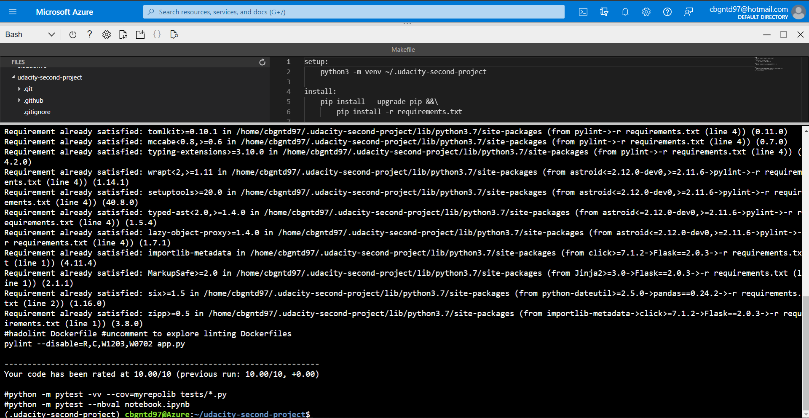
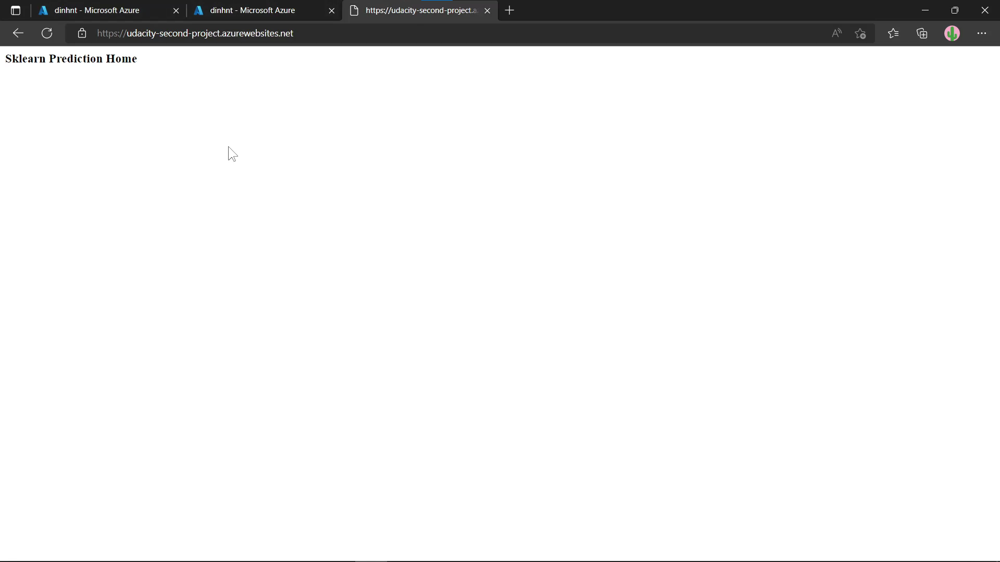

# Overview

[](https://github.com/compimprove/udacity-second-project/actions/workflows/python-app.yml)

This is a Python flask application built for predicting housing prices in Boston. The purpose of this project was to build the Continuous Integration with Github Actions and Continuous Delivery with Azure Pipelines.

## Project Plan
<TODO: Project Plan

* A link to a Trello board for the project
* A link to a spreadsheet that includes the original and final project plan>

## Instructions


### Clone project to Azure Cloud Shell
Open your Azure Cloud Shell and clone this project

### Create python virtual environment and source it
Running these commands in Azure Cloud Shell 
```
python3 -m venv ~/.<your-clone-repo-name>
source ~/.<your-clone-repo-name>/bin/activate
```
### Passing the test
Next, you'll run the `make all` command in your repo to install dependencies and validate your code passing linting and testing


### Deploy the app to Azure App Service
After passing the test, you want to deploy the application to the Azure App Service. Let's run this command
`az webapp up -g <your-resource-group-name> -n <your-webapp-name`
The result will be like this

Navigate to the home page of the application, you'll see this



### Build Azure Pipeline for automatic deployment
1. Create your Azure Devops Organization if you didn't have yet.
2. Create a new project

### Check the stream log
Running `az webapp log tail`, you'll see the stream log of the application


<TODO:  Instructions for running the Python project.  How could a user with no context run this project without asking you for any help.  Include screenshots with explicit steps to create that work. Be sure to at least include the following screenshots:

* Project running on Azure App Service

* Project cloned into Azure Cloud Shell

* Passing tests that are displayed after running the `make all` command from the `Makefile`

* Output of a test run

* Successful deploy of the project in Azure Pipelines.  [Note the official documentation should be referred to and double checked as you setup CI/CD](https://docs.microsoft.com/en-us/azure/devops/pipelines/ecosystems/python-webapp?view=azure-devops).

* Running Azure App Service from Azure Pipelines automatic deployment

* Successful prediction from deployed flask app in Azure Cloud Shell.  [Use this file as a template for the deployed prediction](https://github.com/udacity/nd082-Azure-Cloud-DevOps-Starter-Code/blob/master/C2-AgileDevelopmentwithAzure/project/starter_files/flask-sklearn/make_predict_azure_app.sh).
The output should look similar to this:

```bash
udacity@Azure:~$ ./make_predict_azure_app.sh
Port: 443
{"prediction":[20.35373177134412]}
```

* Output of streamed log files from deployed application

> 

## Enhancements

<TODO: A short description of how to improve the project in the future>

## Demo 

<TODO: Add link Screencast on YouTube>


